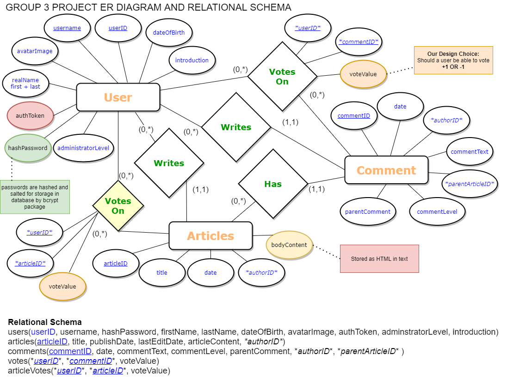
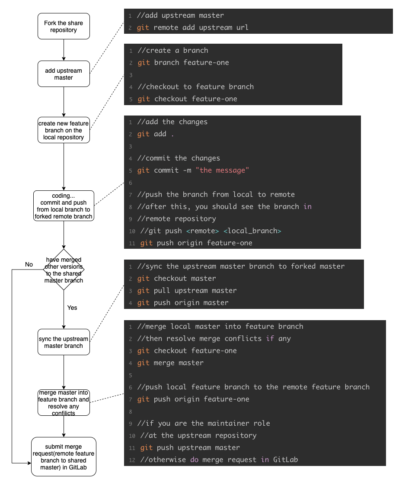

# Final Project (Group 3: ABY) 


by Nick Berg, Yiwei Dao and Allie Lim

 <br> 

## Installation

---

Use the package manager to install modules

```
npm install
```

 <br> 

## Existing User Detail

---

```
UserID:
Password:
```

 <br> 

## Other Comments

---

 <br> 


### Project Management

---

> [Daily Stand-up Minutes](https://docs.google.com/spreadsheets/d/1A6cE_NpLdWxBipJMbmSAjm1dFRkkFupdw-zWFGvOKyc/edit#gid=622856653)

> [Our Trello Board](https://trello.com/b/BV9pKFj5/aby-allie-berg-yiwei-final-project)

 <br> 

### Project Database Design

---




 <br> 

### Git Workflow

---

> Yiwei created a Git flow for us to follow! This allowed us to work fast. 

